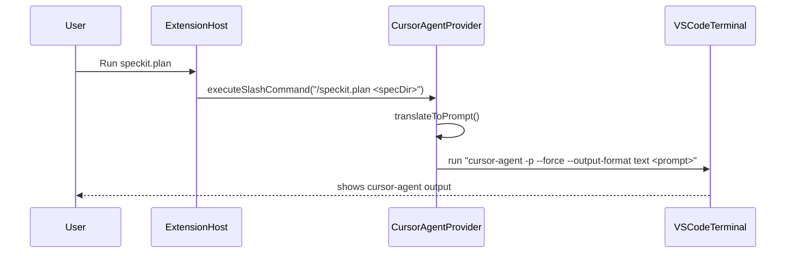

# Plan: Add `cursor-agent` as a new AI provider

## Goal

Enable `speckit.aiProvider = cursor-agent` so SpecKit Companion can drive spec/steering workflows via the `cursor-agent` CLI, following the contract in `docs/Cursor Agent CLI – Agent‑Facing Usage Guide.md` (default **non-interactive**: `-p --output-format json`, and only use `--force` when mutation is required).

## Key constraints / reality checks

- The extension’s spec workflow is currently **slash-command-driven** (e.g. `/speckit.plan`) and assumes the underlying AI CLI understands those (`docs/ai/features/spec-workflow.md`, `src/features/specs/specCommands.ts`).
- `cursor-agent` does **not** implement SpecKit slash commands. So this provider must **translate** these flows into direct prompts that instruct `cursor-agent` to create/update the workspace files the extension expects (e.g. `specs/<name>/{spec,plan,tasks}.md`).
- The current `IAIProvider` interface has no “this call must be mutating” flag. For `cursor-agent` we’ll implement safe defaults:
  - **`executeSlashCommand(...)`** is treated as **mutating** → uses `--force`.
  - **`executeHeadless(...)`** can be **non-mutating by default**, but call sites that require mutation (e.g. steering delete that asks to update a steering index file) should explicitly route through a helper that uses `--force`.

## Design

### 1) New provider type

- Extend `AIProviderType` to include `cursor-agent`.
- Add provider paths for `cursor-agent` in `PROVIDER_PATHS`.
  - Practical default: reuse Claude-style workspace structure (`CLAUDE.md`, `.claude/steering`, `.claude/agents`) so existing views continue to work against the same files.
  - Mark **hooks unsupported** and **MCP view informational only** (similar to non-Claude behavior today).

### 2) New VS Code settings

- Add `speckit.cursorAgentPath` (default: `cursor-agent`) in `package.json`.
- (Optional, but recommended) Add `speckit.cursorAgent.defaultMode` enum: `nonInteractive`/`interactive` (default `nonInteractive`). You selected non-interactive default; this setting just makes it configurable.

### 3) Command translation strategy

Update spec workflow command implementations to call `executeSlashCommand(...)` (not `executeInTerminal(...)`) so providers can implement translation cleanly.

For `cursor-agent`, implement translation from `/speckit.<phase> <arg>` into a prompt like:

- **Create** (`speckit.create`): prompt instructing to create a new folder under `specs/` with a safe name, and write `spec.md`, `plan.md`, `tasks.md` skeleton (or just `spec.md` if you want parity with existing behavior).
- **Phases** (`specify|plan|tasks|implement|clarify|analyze|checklist`): prompt instructing to open `specs/<spec>` directory, read existing docs, and update the relevant file(s).
- **Constitution**: prompt instructing to update `.specify/memory/constitution.md` if present; otherwise explain that SpecKit isn’t initialized.

We’ll keep the UX consistent: commands still run in a visible terminal, but `cursor-agent` will run in `-p` mode by default.

### 4) `cursor-agent` invocation rules (per guide)

- **Non-interactive default**:
  - Visible terminal: `cursor-agent -p --output-format text ...` (humans reading terminal output)
  - Headless/background: `cursor-agent -p --output-format json ...`
- **Mutation**:
  - Add `--force` when the prompt is expected to write files or run shell commands.
  - For SpecKit workflow commands, treat as mutating because they must generate/update markdown specs.

## Implementation steps (files)

1) **Add new provider implementation**

   - Create [`src/ai-providers/cursorAgentProvider.ts`](src/ai-providers/cursorAgentProvider.ts) implementing `IAIProvider`.
   - Implement:
     - `isInstalled()`: check `${cursorAgentPath} --help` (fallback) via `exec`.
     - `executeInTerminal(prompt)`: run `cursor-agent -p --output-format text` (no `--force` by default).
     - `executeHeadless(prompt)`: run hidden terminal with shellIntegration `cursor-agent -p --output-format json`.
     - `executeSlashCommand(command)`: translate and run `cursor-agent -p --force --output-format text`.

2) **Wire provider into factory + exports**

   - Update [`src/ai-providers/aiProvider.ts`](src/ai-providers/aiProvider.ts):
     - Extend `AIProviderType` union.
     - Add `PROVIDER_PATHS['cursor-agent'] `entry (reuse `.claude/*` layout; `supportsHooks: false`).
   - Update [`src/ai-providers/aiProviderFactory.ts`](src/ai-providers/aiProviderFactory.ts):
     - Add case for `cursor-agent`.
     - Add to `getSupportedProviders()`.
   - Update [`src/ai-providers/index.ts`](src/ai-providers/index.ts) to export the provider.

3) **Update VS Code settings schema**

   - Update [`package.json`](package.json):
     - Add enum value `cursor-agent` to `speckit.aiProvider`.
     - Add `speckit.cursorAgentPath` (and optional mode setting).

4) **Make spec workflow provider-agnostic at the call site**

   - Update [`src/features/specs/specCommands.ts`](src/features/specs/specCommands.ts) to call `getAIProvider().executeSlashCommand(...)` for:
     - `speckit.create` (currently uses `executeInTerminal`)
     - All phase commands (currently uses `executeInTerminal`)
     - `speckit.constitution`
   - This keeps existing providers working, while enabling `cursor-agent` to intercept/translate.

5) **Align steering flows with `cursor-agent` mutation rules**

   - For operations that must update files (e.g. `SteeringManager.delete` prompts to update the steering index file), ensure the provider invocation uses a `--force`-capable path.
   - Practical approach:
     - Add a small helper in the provider: `executeHeadlessMutating(prompt)` or use `executeSlashCommand` for mutating ops.
     - Update [`src/features/steering/steeringManager.ts`](src/features/steering/steeringManager.ts) delete flow accordingly.

6) **Update docs**

   - Update [`docs/ai/reference/settings.md`](docs/ai/reference/settings.md) with the new provider + settings.
   - Update [`docs/ai/features/spec-workflow.md`](docs/ai/features/spec-workflow.md) noting that non-Claude providers may translate commands (and `cursor-agent` uses prompt translation, not slash commands).
   - Optionally add a short doc [`docs/ai/features/cursor-agent.md`](docs/ai/features/cursor-agent.md) describing how it runs and what it supports/doesn’t.

## Data flow (new provider)

## Scope notes (what we will *not* do initially)

- No deep integration with MCP listing (today MCP view shells out to `claude mcp ...` only).
- No hooks support (Claude-only today).
- No parsing of `cursor-agent` JSON output into UI (we’ll keep output in terminal; later we can add structured handling).

## Validation checklist

- Set `speckit.aiProvider = cursor-agent` and confirm:
  - `speckit.create` runs and writes `specs/<name>/...`.
  - `speckit.plan/tasks/implement` run without errors and update files.
  - Steering create/refine/delete still runs and updates expected files.
  - Views behave (Agents/Skills/Hooks/MCP show appropriate support messages).