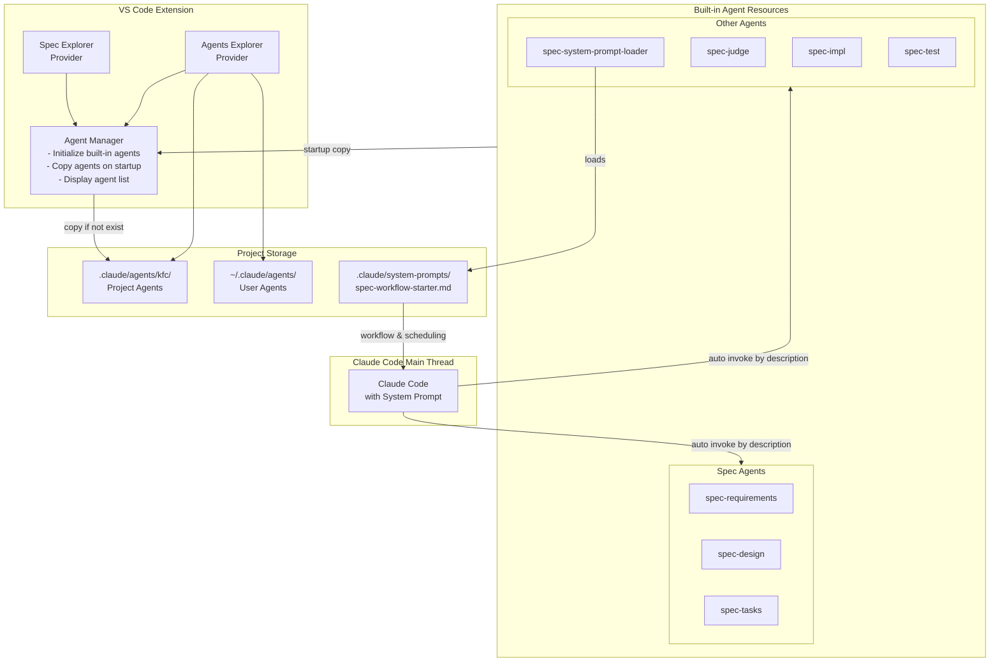

# Design Document

## Overview

This design document describes how to enhance the existing **spec workflow** by introducing multiple specialized **Claude Code subagents**. The design introduces three core subagents (`spec-requirements`, `spec-design`, `spec-tasks`) along with corresponding **VS Code extension integrations**, enabling parallel execution and specialization per workflow stage.

## Architecture

### Overall Architecture



### Component Interactions

1. **Extension startup**: On startup, checks `.claude/agents/kfc/`; missing built-in agents are copied.
2. **Workflow initialization**: `spec-system-prompt-loader` loads `.claude/system-prompts/spec-workflow-starter.md` and provides scheduling rules to the main thread.
3. **Agent management**: `AgentManager` initializes and manages agents but does not invoke them.
4. **Subagent invocation**: Claude Code’s main thread automatically selects and invokes subagents based on system prompt rules.
5. **UI presentation**: Agents Explorer shows project-level and user-level agents and allows viewing/editing.

## Components and Interfaces

### 1. Agent Manager

```ts
interface AgentManager {
  initializeBuiltInAgents(): Promise<void>;
  getAgentList(type: 'project' | 'user' | 'all'): Promise<AgentInfo[]>;
  checkAgentExists(agentName: string, location: 'project' | 'user'): boolean;
  getAgentPath(agentName: string): string | null;
}

interface AgentInfo {
  name: string;
  description: string;
  path: string;
  type: 'project' | 'user';
  tools?: string[];
}
```

### 2. Agents Explorer Provider

```ts
class AgentsExplorerProvider extends vscode.TreeDataProvider<AgentItem> {
  constructor(
    private context: vscode.ExtensionContext,
    private agentManager: AgentManager
  );

  getChildren(element?: AgentItem): Promise<AgentItem[]>;
  refresh(): void;
  openAgentFile(agentPath: string): Promise<void>;
}

class AgentItem extends vscode.TreeItem {
  constructor(
    public readonly label: string,
    public readonly agentInfo: AgentInfo,
    public readonly collapsibleState: vscode.TreeItemCollapsibleState
  );
}
```

### 3. Built-in Agent Initialization Flow

```ts
class AgentInitializer {
  private readonly BUILT_IN_AGENTS = [
    'spec-requirements',
    'spec-design',
    'spec-tasks',
    'spec-system-prompt-loader',
    'spec-judge',
    'spec-impl',
    'spec-test'
  ];

  async initializeOnStartup(): Promise<void> {
    const targetDir = path.join(workspaceRoot, '.claude/agents/kfc');

    for (const agentName of this.BUILT_IN_AGENTS) {
      const targetPath = path.join(targetDir, `${agentName}.md`);

      if (!fs.existsSync(targetPath)) {
        await this.copyBuiltInAgent(agentName, targetPath);
      }
    }
  }

  private async copyBuiltInAgent(agentName: string, targetPath: string): Promise<void> {
    const sourcePath = path.join(extensionPath, 'resources/agents', `${agentName}.md`);
    await fs.promises.copyFile(sourcePath, targetPath);
  }
}
```

### 4. Built-in Spec Subagents

**Core Spec Agents**

* `spec-requirements`: Produces and refines EARS-style requirement documents.
* `spec-design`: Produces detailed technical designs based on requirements.
* `spec-tasks`: Converts designs into executable implementation tasks.

**Supporting Agents**

* `spec-system-prompt-loader`
* `spec-judge`
* `spec-impl`
* `spec-test`

All are copied to `.claude/agents/kfc/` at initialization.

## Data Model

### Agent Configuration File

```ts
interface AgentConfig {
  name: string;
  description: string;
  tools?: string[];
  systemPrompt: string;
}
```

### Storage Locations

* Project agents: `.claude/agents/kfc/*.md`
* User agents: `~/.claude/agents/*.md`
* Built-in resources: `resources/agents/*.md`

## Error Handling

* **Initialization failure**: Logged; other agents continue.
* **Edit confirmation**: Modal confirmation before saving changes.
* **Missing agent files**: Automatically restored on next startup.

## Testing Strategy

* **Unit**: AgentManager, AgentsExplorerProvider.
* **Integration**: Full workflow, parallel execution, recovery.
* **UAT**: UI, performance, backward compatibility.

## Implementation Notes

* Backward compatible
* Cache filesystem access
* Clear UX feedback
* Restricted agent permissions
* Extensible design
* Dual-entry support (legacy + subagent workflow)

---

