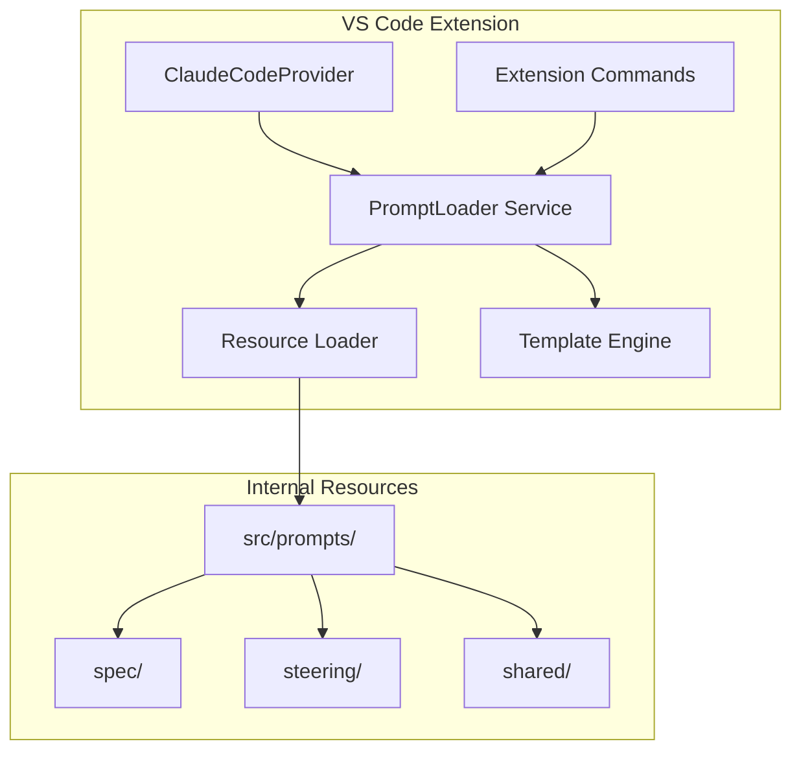

# Design Document – Prompt Separation for SpecKit Companion

## Overview

This design proposes separating the **hard-coded prompt templates** currently embedded in the SpecKit Companion extension into **independent Markdown files** managed as internal resources.
By introducing a standardized prompt file structure and loading mechanism, the solution improves **maintainability**, **developer productivity**, and **long-term scalability**.

## Architecture

### System Architecture Diagram



### Core Design Principles

1. **One-step replacement**: Fully replace all hard-coded prompts; no fallback logic is retained.
2. **Simplicity first**: Minimize layers and reduce overall complexity.
3. **Developer-friendly**: Provide tooling and debugging support for prompt development.
4. **Performance-oriented**: Use caching to avoid repeated file I/O.

## Components and Interfaces

### 1. Prompt File Format

Prompts use **Markdown + Frontmatter** to cleanly separate configuration from content.

```md
---
id: spec-agent-system
name: Spec Agent System Prompt
version: 1.0.0
description: System prompt for spec agent workflow
variables:
  specsPath:
    type: string
    required: true
    description: Base path for specs
---
```

**Advantages**

* Natural Markdown authoring, no escaping
* Structured metadata via frontmatter
* Native VS Code preview and highlighting
* Git-friendly version control

### 2. PromptLoader Service

The core service responsible for **loading, parsing, compiling, and rendering** prompts.

**Key characteristics**

* Markdown files are compiled into TypeScript modules at build time
* `gray-matter` parses frontmatter
* `Handlebars` handles variable interpolation
* All templates are precompiled and cached in memory at startup

```ts
interface PromptLoader {
  loadPrompt(promptId: string): PromptTemplate;
  renderPrompt(promptId: string, variables: Record<string, any>): string;
  listPrompts(): PromptMetadata[];
  initialize(): void;
}
```

### 3. Prompt Export Interface

Existing hard-coded prompt accessors are replaced internally, while keeping external APIs stable.

```ts
export function getSpecAgentSystemPrompt(specsPath: string): string {
  return loader.renderPrompt('spec-agent-system', { specsPath });
}
```

## Data Models

### Directory Structure

```
src/
├── prompts/
│   ├── spec/
│   ├── steering/
│   └── shared/
├── services/
│   └── promptLoader.ts
└── types/
    └── prompt.types.ts
```

### Prompt Frontmatter Schema

```ts
interface PromptFrontmatter {
  id: string;
  name: string;
  version: string;
  description?: string;
  author?: string;
  tags?: string[];
  extends?: string;
  variables?: Record<string, VariableDefinition>;
}
```

## Error Handling

### Error Types and Strategies

1. **Missing resource**

   * Build-time failure in development
   * Explicit runtime error with available prompt IDs

2. **Syntax errors**

   * Editor-time diagnostics
   * Save-time validation blocking
   * Repair hints

3. **Missing variables**

   * Use defaults when defined
   * Explicit error listing required variables

4. **Version incompatibility**

   * Schema validation
   * Migration guidance
   * Backward compatibility

## Testing Strategy

### Unit Tests

* PromptLoader logic
* Variable substitution
* Cache behavior
* Error scenarios

### Integration Tests

* End-to-end prompt rendering
* Prompt editing lifecycle
* Functional parity with previous implementation

### Manual Testing

* Authoring experience
* Error diagnostics
* Prompt debugging
* Spec and Steering workflows

## Implementation Details

### Technology Choices

* Frontmatter parsing: `gray-matter`
* Template engine: `handlebars`
* Build-time resource compilation
* In-memory template caching

### Performance Optimizations

* Preload all prompts at extension activation
* Precompile templates
* Fully synchronous runtime access
* Zero runtime file I/O

### Security Considerations

* Prompts are bundled, not user-modifiable
* Variable escaping to prevent template injection
* Strong typing via TypeScript
* Build-time validation of all prompt assets

## Task Implementation Context Design (Future Work)

> **Note**: This section is a design memo only and is not implemented as part of the current prompt-separation scope.

When executing individual spec tasks, Claude Code should receive **full contextual input**, including:

* Project-level steering documents
* Feature-level spec documents
* The currently selected task

This ensures correctness, consistency, and automation when executing tasks.

---
